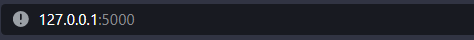
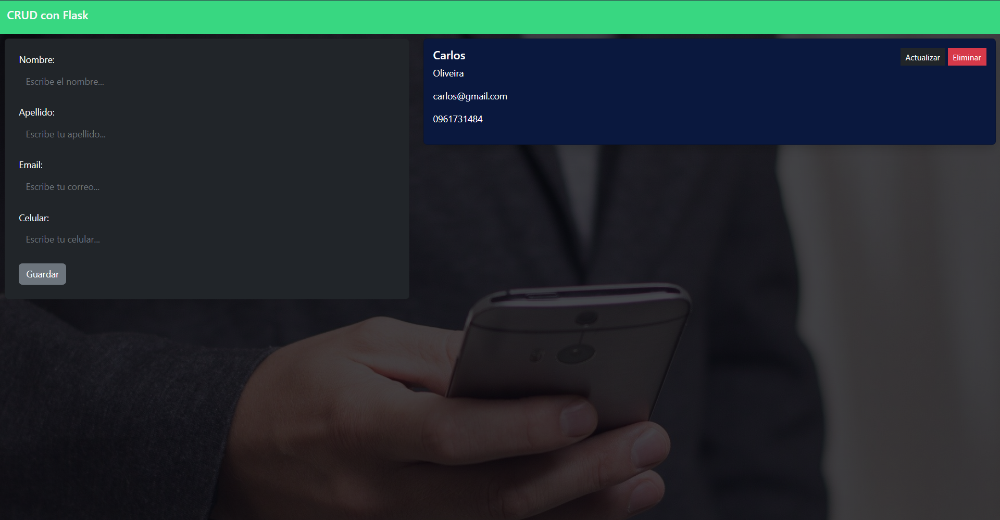

# Libreta de Contactos 📖

Aplicación creada en **Python** usando **Flask** y **SQLAlchemy**. 👨‍💻

<div align="center">
  <a href="https://www.python.org" target="_blank" rel="noreferrer"> </a>
  <a href="https://flask.palletsprojects.com/" target="_blank" rel="noreferrer">  </a>
</div>

1. Para poder usarla debemos crear un archivo **.env** y poner colocar las credenciales necesarias:
```python
MYSQL_USER = #usuario
MYSQL_PASSWORD = #contraseña
MYSQL_HOST = #localhost
MYSQL_DATABASE = #nombrebdd
```


2. Usar el siguiente comando:

```bash
python -m pip install -r requirements.txt
```

3. Para usar la aplicación:
```bash
python index.py
```

**Salida**
```
 * Serving Flask app 'app' (lazy loading)
 * Environment: production
   WARNING: This is a development server. Do not use it in a production deployment.
   Use a production WSGI server instead.
 * Debug mode: on
 * Running on http://127.0.0.1:5000 (Press CTRL+C to quit)
 * Restarting with stat
 * Debugger is active!
 * Debugger PIN: 616-451-385
```

4. En el navegador pegar la dirección que nos brinda el programa:


5. Ventana principal de la aplicación:




